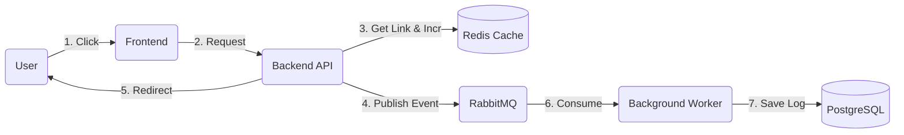

# 🚀 Scalable URL Shortener

A high-performance, microservices-based URL shortening application designed for scalability and modern DevOps practices.
The project demonstrates an **Event-Driven Architecture** using **Python (Flask)**, **Vue.js 3 (Vite)**, **Redis**, **RabbitMQ**, and **PostgreSQL**.

---

## 🌟 Key Features

* **⚡️ Blazing Fast Redirection:** Uses **Redis** in-memory caching to redirect users instantly without querying the disk-based database.
* **📈 Real-time Analytics:** Tracks clicks instantly using Redis counters.
* **📩 Asynchronous Logging:** Uses **RabbitMQ** and a background **Worker** to save detailed logs (User-Agent, Timestamp, IP) to **PostgreSQL** without blocking the user request.
* **🛠 Modern Frontend:** Built with **Vue.js 3** and **Vite**, served via **Nginx** (Multi-stage Docker build).
* **🐳 Fully Dockerized:** Ready to deploy with a single command using `docker-compose`.

---

## 🏗 Architecture

The system is split into isolated microservices:

1.  **Frontend (Vue.js + Nginx):** A responsive UI for creating links and viewing stats.
2.  **Backend (Flask API):** Handles requests, manages caching, and publishes events to the queue.
3.  **RabbitMQ (Message Broker):** Buffers "Click Events" to handle high traffic loads.
4.  **Worker (Python):** Consumes messages from RabbitMQ and saves data to the database in the background.
5.  **Redis (Cache):** Stores hot data (short links) and real-time counters.
6.  **PostgreSQL (DB):** Persistent storage for links and detailed analytics history.

### Data Flow Diagram




## 🛠 Tech Stack

| Component | Technology | Role |
|-----------|------------|------|
| **Frontend** | Vue.js 3, Vite, Bootstrap | User Interface |
| **Server** | Nginx (Alpine) | Static File Serving & Reverse Proxy |
| **Backend** | Python 3.9, Flask | REST API |
| **Database** | PostgreSQL 15 | Persistent Data Storage |
| **Cache** | Redis | High-speed Caching & Counters |
| **Queue** | RabbitMQ | Asynchronous Message Broker |
| **DevOps** | Docker, Docker Compose | Containerization & Orchestration |


## 🚀 Getting Started (Local)

### Prerequisites
* Docker & Docker Compose installed.

### Installation

1.  **Clone the repository:**
    ```bash
    git clone [https://github.com/Kavallerya/url-shortener.git]
    cd url-shortener
    ```

2.  **Setup Environment Variables:**
    Create a `.env` file in the root directory and add your secrets:
    ```bash
    # Create .env file
    echo "POSTGRES_USER=user" >> .env
    echo "POSTGRES_PASSWORD=password" >> .env
    echo "POSTGRES_DB=urls_db" >> .env
    echo "RABBITMQ_DEFAULT_USER=guest" >> .env
    echo "RABBITMQ_DEFAULT_PASS=guest" >> .env
    ```

3.  **Run with Docker Compose:**
    ```bash
    docker-compose up --build
    ```


    ## ☁️ Deployment (Railway/Production)

This project is configured for seamless deployment on [Railway.app](https://railway.app/).

### Environment Variables
When deploying, ensure the following variables are set:

**Backend & Worker:**
* `DATABASE_URL`: Connection string to PostgreSQL.
* `REDIS_URL`: Connection string to Redis (including password).
* `RABBITMQ_HOST`: Hostname of the RabbitMQ service (e.g., `rabbitmq`).
* `PORT`: `5000`

**Frontend:**
* `VITE_BACKEND_URL`: The public URL of your deployed Backend (e.g., `https://web-production-xxxx.up.railway.app`).
* `PORT`: `80`


    
